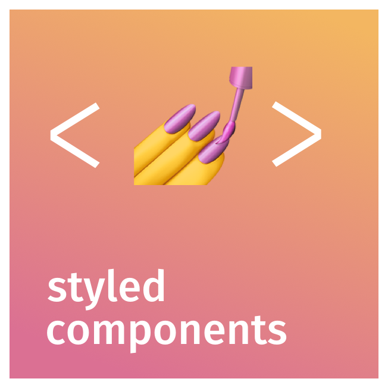

# Hello 👋🏼 I'm **Jorge**

> Welcome to my Github! ☕ 💻 🚀

---

## How to reach me 📫

  <a href="https://www.linkedin.com/in/jorgedelafuente/" target="_blank" style="display:inline-flex;align-items:center;background:#0077B5;color:#fff;padding:8px 14px;border-radius:4px;text-decoration:none;gap:8px;height:32px;box-sizing:border-box;font-size:14px;font-family:sans-serif">
    <svg xmlns="http://www.w3.org/2000/svg" viewBox="0 0 24 24" width="18" height="18" fill="#fff"><path d="M20.447 20.452h-3.554v-5.569c0-1.328-.027-3.037-1.852-3.037-1.853 0-2.136 1.445-2.136 2.939v5.667H9.351V9h3.414v1.561h.046c.477-.9 1.637-1.85 3.37-1.85 3.601 0 4.267 2.37 4.267 5.455v6.286zM5.337 7.433a2.062 2.062 0 0 1-2.063-2.065 2.064 2.064 0 1 1 2.063 2.065zm1.782 13.019H3.555V9h3.564v11.452zM22.225 0H1.771C.792 0 0 .774 0 1.729v20.542C0 23.227.792 24 1.771 24h20.451C23.2 24 24 23.227 24 22.271V1.729C24 .774 23.2 0 22.222 0h.003z"/></svg>LinkedIn
  </a>
  <a href="mailto:techjorge7@gmail.com" style="display:inline-flex;align-items:center;background:#D14836;color:#fff;padding:8px 14px;border-radius:4px;text-decoration:none;gap:8px;height:32px;box-sizing:border-box;font-size:14px;font-family:sans-serif">
    <svg xmlns="http://www.w3.org/2000/svg" viewBox="0 0 24 24" width="18" height="18" fill="#fff"><path d="M24 5.457v13.909c0 .904-.732 1.636-1.636 1.636h-3.819V11.73L12 16.64l-6.545-4.91v9.273H1.636A1.636 1.636 0 0 1 0 19.366V5.457c0-2.023 2.309-3.178 3.927-1.964L5.455 4.64 12 9.548l6.545-4.91 1.528-1.145C21.69 2.28 24 3.434 24 5.457z"/></svg>Email
  </a>

---

## Technologies and tools I use 🔧

  
  
  
  
  

 

  
  
  
  
  

 

  
  
  
  
  

 

  
  
  
  
  

 

  
  
  
  
  

 

  
  
  
  
  

---

## GitHub Stats 📊

---

